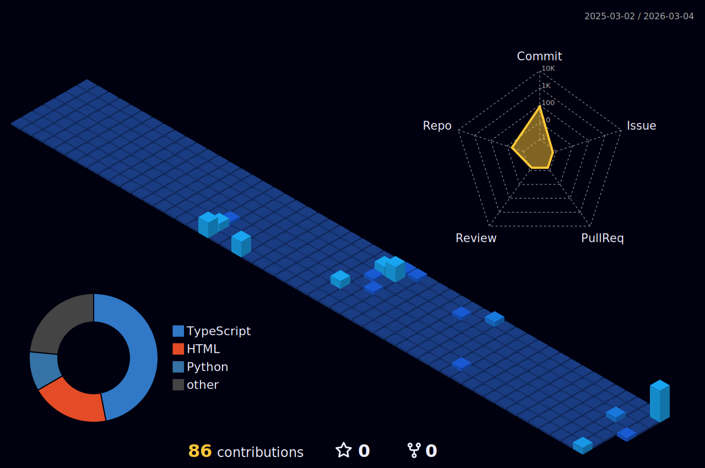

<h1 align="center">TheSlayer7</h1>

  

  

    <b>Currently learning to be a good developer. I love science, coding, and building.</b>  
    Bridging that drive with a focus on machine intelligence and planetary systems.  
    Architecting at the intersection of deep learning and the cosmos—translating neural architectures into the high-performance networks of the next frontier.
  

   
  

  

<h3 align="center">Technical Arsenal</h3>

  
    
  
    
  

  

<h3 align="center">Activity Architecture</h3>

  

 

